# FortiADC integration with FortiADC Kubernetes Controller: VirtualServer CustomResource that supports for Kubernetes TCP/UDP services
-   **Introduction to the VirtualServer CRD** – Enabling support for Kubernetes TCP/UDP services beyond traditional HTTP routing.
-   **Calico with VXLAN CNI Integration** – Leveraging Calico's VXLAN support for flexible, scalable network overlays.
-   **Live Demo Scenario** – Showcasing real-world use of the VirtualServer CRD and Calico VXLAN in a Kubernetes environment. This demo shows how we can define a **TCP VirtualServer** as a **Custom Resource (CR)** inside the Kubernetes cluster — using our own VirtualServer CRD. The **FortiADC Kubernetes Controller** watches for VirtualServer Custom Resource and associated resources like **Services, Pods, and VXLAN networking**, then **translates and deploys them** into corresponding **FortiADC objects**. As a result, users can simply connect to the **FortiADC TCP VirtualServer**, and that traffic is securely proxied to the **PostgreSQL database running inside Kubernetes**.

```mermaid
flowchart LR

  subgraph "Kubernetes Cluster<br>(Microk8s with Calico VXLAN CNI)"
    topdummy[" "]:::invisible
    pgsvc["PostgreSQL Service"]
    sslpg["🔒 PostgreSQL Pod<br>SSL enabled + Cert Verification"]
    pgsvc --> sslpg
  end

  client["psql client"] --> l4vs["FortiADC Layer4 TCP VirtualServer<br>(172.23.133.109:5432)"]
  l4vs --> route["Content Routing<br>sourceAddress 172.23.133.0/24"]
  route --> pgsvc
  classDef invisible fill:none,stroke:none;
  class topdummy invisible
```



## Outline

1.  Scenario Overview:
    Deployment of a TCP Virtual Server CustomResource to expose a PostgreSQL server with SSL enabled on Kubernetes, using Calico VXLAN as the CNI plugin.
2.  Integration Steps:
    How to integrate FortiADC with Kubernetes in a Calico VXLAN environment.
3.  Deployment Steps:
    How to deploy the TCP Virtual Server Custom Resource to expose the PostgreSQL server with SSL enabled.

## Scenario Overview


## Integrate FortiADC with Kubernetes in a Calico VXLAN environment.

### Download FortiADC image


    https://info.fortinet.com/files/FortiADC/v8.00/images/NoMainBranch/fadc_8-0_p1_fr2810_calico_vxlan/build_tag_6053/


### Deploy FortiADC as a fake node in the Kubernetes cluster

#### Download the calico fake node file

	curl -k https://raw.githubusercontent.com/hsandy123/fortiadc-kubernetes-controller/refs/heads/main/node_examples/calico_fake_fadc_node.yaml -o calico_fake_fadc_node.yaml

The fake node configuration also with fake ipamhandle, ipamblock and BlockAffinity configuraion
These are the network configuration Calico needed for a new node, the node IP address and subnet should be the same in all of these config.

#### Replace the fake node annotation and all ipam config to fit your enviornment

```
apiVersion: v1
kind: Node
metadata:
    name: fadc-fake-node
    annotations:
        #Replace IPv4Address with outgoing interface IP of overlay tunnel
        projectcalico.org/IPv4Address: 172.23.133.171/24
        #Replace IPv4VXLANTunnelAddr with your VXLAN interface IP
        projectcalico.org/IPv4VXLANTunnelAddr: 10.1.187.192
```

By default calico set pod CIDR for Kubernetes cluster is 10.1.0.0/16, each node's pod cidr block is 26
You can set the IPv4VXLANTunnelAddr in any subset of the pod network if and only if the network subset is not used by another node.
For example, we claim the subset 10.1.187.192/26 for FortiADC.

Note that ipamhandle, ipamblock, BlockAffinity and node are conneted by the IPv4VXLANTunnelAddr.

The BlockAffinity name and cidr is the same as node name and IPv4VXLANTunnelAddr

```
apiVersion: crd.projectcalico.org/v1
kind: BlockAffinity
metadata:
    # Combination of node name and IPv4VXLANTunnelAddr
    name: fadc-fake-node-10-1-187-192-26

spec:
    # IPv4VXLANTunnelAddr, default Calico PodCIDR block is 26.
    cidr: 10.1.187.192/26
    # Node name
    node: fadc-fake-node
    deleted: "false"
    state: confirmed
```

IPAMBlock is connect to BlockAffinity and node

```
apiVersion: crd.projectcalico.org/v1
kind: IPAMBlock
metadata:
    # IPv4VXLANTunnelAddr
    name: 10-1-187-192-26
spec:
    # IPv4VXLANTunnelAddr 
    cidr: 10.1.187.192/26
    affinity: host:fadc-fake-node
```

IPAMHandle is connected to IPAMBlock

```
apiVersion: crd.projectcalico.org/v1
kind: IPAMHandle
metadata:
    name: vxlan-tunnel-addr-fadc-fake-node
spec:
    handleID: vxlan-tunnel-addr-fadc-fake-node
    block:
        # IPv4VXLANTunnelAddr 
        10.1.187.192/26: 1

```


#### Apply the Calico fake node to Kubernetes cluster

	kubectl apply -f calico_fake_fadc_node.yaml

### Check calico vxlan vni and port

#### Use kubectl command to check calico vxlan vni and port


	kubectl get felixconfiguration default -o yaml


Without specific configuration in felixconfiguraion, the default Calico VxLAN VNI is 4096, and the VxLAN port is UDP port 4789.
The default value may not show in felixconfiguraion.

#### The other way is to check vxlan.calico interface

	ip -d link show vxlan.calico


Calico will create a vxlan.calico interface on each node, you can also directly check the vxlan settings in this interface.


### Found the Mac address that calico assign for the FortiADC fake node


Calico will assign a MAC address for the FortiADC fake node,  found the address in ARP table of master node.


	ip neigh show | grep PERMANENT


We assign an IP address for FortiADC in the fake node, and the MAC address is assigned by Calico.


### Create an overlay tunnel in FortiADC

To integrate the FortiADC overlay tunnel with the calico VxLAN, an overlay tunnel with the VxLAN type must be created in FortiADC

#### In FortiADC, go to Network > Interface and click the Overlay Tunnel tab.

Select VXLAN as the Mode and Calico VXLAN as the VXLAN Type, need to set the interface MAC for VxLAN interface
The following is a sample of FortiADC configuration
The MAC address that Calico assign for fake node need to configure to FortiADC to vxlan-interface-mac


	config system overlay-tunnel
		edit "k8s_calico"
			set vxlan-type calico_vxlan
			set interface port1
			set destination-ip-addresses 172.23.133.48
			set vxlan-interface-mac 66:18:7a:f4:7b:9e
			set vni 4096
			config  remote-host
			end
			config  arp
			end
		next
	end


Note that the overlay-tunnel name should be set in annotation "overlay-tunnel" when apply Service to Kubernetes cluster.

### Set IP for VxLAN interface

#### Go to Network > Interface. In the Interface page, locate the Interface configuration that share the same name as the overlay tunnel you just created

specify the network interface IP and the netmask as the one used in your Kubernetes cluster CIDR netmask size.
Also allow ping/http/https traffic to go through the interface

Here we set the overlay tunnel interface to be 10.1.187.192/16

	config system interface
		edit "k8s_calico"
			set type vxlan
			set vxlan-type calico_vxlan
			set vdom root
			set ip 10.1.187.192/16
			set allowaccess https ping http
			set mtu 1450
			set mac addr 66:18:7a:f4:7b:9e
			config  ha-node-ip-list
			end
		next
	end


## Deploy the TCP Virtual Server Custom Resource to expose the PostgreSQL server with SSL enabled.

### Installation
Install the FortiADC Kubernetes Controller using Helm Charts.

:bulb: Currently, only Helm 3 (version 3.6.3 or later) is supported.

Helm Charts ease the installation of the FortiADC Kubernetes Controller in the Kubernetes cluster. By using the Helm 3 installation tool, most of the Kubernetes objects required for the FortiADC Ingress Controller can be deployed in one simple command.

To get the verbose output, add --debug option for all the Helm commands.

#### Install cert-manager.io

The version of cert manager we had verified is v1.18.2

https://cert-manager.io/docs/installation/


    helm repo add jetstack https://charts.jetstack.io
    helm repo update

    helm install --debug cert-manager jetstack/cert-manager \
           --namespace cert-manager \
           --create-namespace \
           --version v1.19.1 \
           --set crds.enabled=true


#### Create credential to access FortiADC Kubernetes Controller image

Please refer to the private_install.pdf

#### Get Repo Information


    helm repo add fortiadc-kubernetes-controller https://hsandy123.github.io/fortiadc-kubernetes-controller

    helm repo update

#### Install FortiADC Ingress Controller

    helm install --devel --debug first-release --namespace fortiadc-ingress --create-namespace --version 3.1.0-70 --wait fortiadc-kubernetes-controller/fadc-k8s-ctrl

#### Check the installation

    helm history -n fortiadc-ingress first-release

    kubectl get -n fortiadc-ingress deployments

    kubectl get -n fortiadc-ingress pods

Check the log of the FortiADC Kubernetes Controller.

    kubectl logs -n fortiadc-ingress -f [pod name]

#### Upgrading chart

    helm repo update
    helm upgrade --devel --debug --reset-values -n fortiadc-ingress first-release fortiadc-kubernetes-controller/fadc-k8s-ctrl

#### Uninstall Chart

    helm uninstall -n fortiadc-ingress first-release

### Configuration parameters
#### FortiADC Authentication Secret

As shown in above figure, the FortiADC Kubernetes Controller satisfies an Ingress by FortiADC REST API call, so the authentication parameters of the FortiADC must be known to the FortiADC Kubernetes Controller.

To preserve the authentication securely on the Kubernetes cluster, you can save it with the Kubernetes secret. For example

    kubectl create secret generic fad-login -n [namespace] --from-literal=username=admin --from-literal=password=[admin password]

The secret is named fad-login. This value will be specified in the Ingress annotation "fortiadc-login" for the FortiADC Kubernetes Controller to get permission access on the FortiADC.

:warning:  The namespace of the authentication secret must be the same as the Ingress/virtualserver which references this authentication secret.
#### Virtual Server Configuration Fields
##### Annotation in VirtualServer
Configuration parameters are required to be specified in the VirtualServer annotation to enable the FortiADC Kubernetes Controller to determine how to deploy the VirtualServer resource.

|Parameter  | Description | Default |
|--|--|--|
| fortiadc-ip | The VirtualServer will be deployed on the FortiADC with the given IP address or domain name. <br> **Note**: This parameter is **required**. | |
| fortiadc-admin-port | FortiADC https service port. | 443|
| fortiadc-login | The Kubernetes secret name preserves the FortiADC authentication information. <br> **Note**: This parameter is **required**. | |
| fortiadc-ctrl-log | Enable/disable the FortiADC Kubernetes Controller log. Once enabled, the FortiADC Kubernetes Controller will print the verbose log the next time the VirtualServer is updated. |enable |

##### VirtualServer Resource Specification


| Field                     | Type     | Description                                                                                                                                                                     | Default              |
|--------------------------|----------|---------------------------------------------------------------------------------------------------------------------------------------------------------------------------------|----------------------|
| addressType              | string   | Specifies the IP version for the virtual server (ipv4 or ipv6).                                                                                                                 | ipv4                 |
| address                  | string   | The VirtualServer IP on FortiADC where client traffic is received. This parameter is required.                                                                                  |                      |
| port                     | int      | The listening port of the virtual server, typically 443 for HTTPS.                                                                                                              | 443                  |
| interface                | string   | The FortiADC network interface for the client to access the virtual server (e.g., port1).                                                                                       | port1                |
| loadBalanceProfile       | string   | The load balancing profile to be used. Allowed values: `LB_PROF_HTTPS`, `LB_PROF_HTTP`, `LB_PROF_TCP`, `LB_PROF_UDP`                                                           | LB_PROF_HTTPS        |
| loadBalanceMethod        | string   | Load balancing method, such as `LB_METHOD_ROUND_ROBIN`.                                                                                                                         | LB_METHOD_ROUND_ROBIN |
| persistence              | string   | persistence rule, such as `LB_PERSIS_HASH_SRC_ADDR`.                                                                                                                            |                        |
| wafProfile               | string   | The name of the Web Application Firewall (WAF) profile to apply.                                                                                                                |                      |
| captchaProfile           | string   | CAPTCHA profile to enable human verification security features.                                                                                                                 |                      |
| avProfile                | string   | Antivirus profile to scan traffic for threats.                                                                                                                                  |                      |
| dosProfile                | string   | The dosProfile defines the configuration used to detect and mitigate denial-of-service (DoS) attacks..                                                                                                                                  |                      |
| trafficGroup             | string   | The traffic group that this virtual server belongs to for traffic forwarding.                                                                                                   | default              |
| fortiview                | string   | Enables/disables FortiView, FortiADC's traffic visualization and analytics (`enable` or `disable`).                                                                            | disable              |
| trafficLog               | string   | Enables/disables logging of traffic handled by this virtual server (`enable` or `disable`).                                                                                     | disable              |
| wccp                     | string   | Enables/disables WCCP (Web Cache Communication Protocol) (`enable` or `disable`).                                                                                               | disable              |
| fortigslbPublicIpType    | string   | Type of public IP used for FortiGSLB (usually ipv4).                                                                                                                            | ipv4                 |
| fortigslbPublicAddress   | string   | The public IP address used for global server load balancing (GSLB).                                                                                                             |                      |
| fortigslbOneClick        | string   | Enables/disables FortiADC’s one-click GSLB configuration feature (`enable` or `disable`).                                                                                       | disable              |
| fortigslbHostName        | string   | Hostname registered for GSLB.                                                                                                                                                   |                      |
| fortigslbDomainName      | string   | Domain name associated with the GSLB hostname.                                                                                                                                  |                      |
| realServerPool           | object   | Direct backend service definition. Use instead of `contentRoutings`.                                                                                                            |                      |
| contentRoutings          | list     | Defines Layer 4 and Layer 7 routing rules. See table below for fields.                                                                                                          |                      |
| natSourcePoolList        | list     | List of SNAT (source NAT) pools. Ensure each SNAT pool already exists on FortiADC.                                                                                              |                      |
| tls                      | list     | TLS certificate configurations. Each includes: `hosts` (list of hostnames), `secretName` (Kubernetes TLS secret).                                                              |                      |
| vdom                     | string   | Specifies the VDOM (Virtual Domain) on FortiADC where the virtual server is deployed.                                                                                           |                      |

---

`realServerPool` Field Details

| Field            | Type                 | Description                                                                                                                                       |
|------------------|----------------------|---------------------------------------------------------------------------------------------------------------------------------------------------|
| service          | string               | Name of the Kubernetes service that this virtual server routes traffic to. Must match valid DNS label format (e.g., my-service).                  |
| servicePort      | integer or string    | Port of the target service. Can be numeric (e.g., 80) or named (e.g., "http").                                                                   |
| serviceNamespace | string (optional)    | Namespace of the target service. Defaults to the namespace of the VirtualServer resource if not specified. Useful for cross-namespace routing.   |

---

`contentRoutings` Field Details

| Field                      | Type     | Description                                                                                                                                                   | Default        |
|---------------------------|----------|---------------------------------------------------------------------------------------------------------------------------------------------------------------|----------------|
| name                      | string   | A unique name for the routing rule.                                                                                                                           |                |
| type                      | string   | Type of content routing. Valid values: `l4-content-routing` or `l7-content-routing`.                                                                          | l7-content-routing |
| host                      | string   | The hostname (FQDN) to match for this rule (e.g., example.com, *.foo.com). Only for `l7-content-routing`.                                                    |                |
| path                      | string   | The URL path to match (e.g., /, /info, /hello). Only for `l7-content-routing`.                                                                                |                |
| pathType                  | string   | Path matching type: `Prefix` or `Exact`. Only for `l7-content-routing`.                                                                                       |                |
| sourceAddressType         | string   | IP version for source address matching (ipv4 or ipv6). Only for `l4-content-routing`.                                                                         | ipv4           |
| sourceAddress             | string   | Source address in CIDR form (e.g., 0.0.0.0/0, ::/0). Only for `l4-content-routing`.                                                                           | 0.0.0.0/0      |
| realServerPool.service    | string   | Name of the Kubernetes Service to route traffic to.                                                                                                           |                |
| realServerPool.servicePort| int      | Target port of the Kubernetes Service.                                                                                                                        |                |
| realServerPool.serviceNamespace | string | Kubernetes namespace where the service resides.                                                                                                              |                |
### Deployment steps

#### Deploy the Pods and expose the Services

Download the PostgresSQL with SSL enabled service yaml file:

     curl -k https://raw.githubusercontent.com/hsandy123/fortiadc-kubernetes-controller/refs/heads/main/service_examples/postgresql_ssl_service.yaml -o postgresql_ssl_service.yaml

:warning:  Please make sure you had installed the cert-manager. The certificates used in this example are all auto-signed and issued by cert-manager.

Modify the Service Annotation in postgresql_ssl_service.yaml to accommodate to your environment, ex: change the name of overlay_tunnel if your want to expose your service with ClusterIP type. Then deploy the PostgresSQL with SSL enabled service with kubectl command

    kubectl apply -f postgresql_ssl_service.yaml

#### Deploy the VirtualServer

Download the virtualserver_postgres_ssl.yaml


    curl -k https://raw.githubusercontent.com/hsandy123/fortiadc-kubernetes-controller/refs/heads/main/customResource/virtualserver_postgres_ssl.yaml -o virtualserver_postgres_ssl.yaml

Modify the VirtualServer Annotation in virtualserver_postgres_ssl.yaml to accommodate to your environment, ex: fortiadc-ip, fortiadc-admin-port, etc.. Also, modify the VirtualServer Spec, ex: address, contentRoutings.SourceAddress.  Then deploy the virtualserver with kubectl command

>[!NOTE]
>When configuring a Layer 4 VirtualServer, the default packet forwarding method is Full NAT.  Therefore, the `natSourcePoolList` field **must** be specified in the custom resource definition. Before deploying the VirtualServer CR, you **must** pre-configure a SNAT pool on the FortiADC.  The SNAT IP address range should **match the subnet of the VXLAN interface**, so that the return traffic is correctly routed.

    kubectl apply -f virtualserver_postgres_ssl.yaml

Try to access PostgreSQL use psql client.

```bash
psql "host=172.23.133.109 port=5432 dbname=mydb user=admin password=StrongP@ssw0rd sslmode=require"

```

```bash
~$ psql "host=172.23.133.109 port=5432 dbname=mydb user=admin password=StrongP@ssw0rd sslmode=require"
psql (10.23 (Ubuntu 10.23-0ubuntu0.18.04.2), server 16.10)
WARNING: psql major version 10, server major version 16.
         Some psql features might not work.
SSL connection (protocol: TLSv1.3, cipher: TLS_AES_256_GCM_SHA384, bits: 256, compression: off)
Type "help" for help.

mydb=#

```
